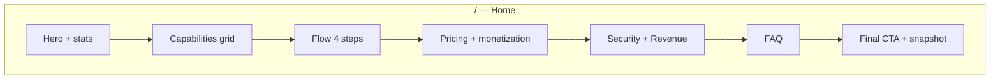

# Public sahifalar (landing, features, va boshqalar) — rasm joylari va o‘lchamlar

Bu hujjat dizayner va frontend uchun: **qayerga** rasm qo‘yiladi, **qanday** rasm (mazmun), **qanday o‘lcham** (export), **qanday format**. Kodda hozircha ko‘p joyda faqat ikonka/matn bor — rasmlarni `apps/web/public/...` ga qo‘yib, keyin `next/image` bilan komponentga ulash reja bo‘yicha keyingi qadam.

**Umumiy texnik qoidalar**

| Parametr | Tavsiya |
|----------|---------|
| Asosiy format | **WebP** (shaffof fon kerak bo‘lsa PNG, animatsiya kerak bo‘lsa GIF/WebP anim) |
| Zaxira | JPEG faqat fotorealistik va fon kerak bo‘lmasa |
| Retina | Dizayn **1x** bo‘yicha; exportda **2x** (@2x) yoki vektor SVG ikonlar |
| Fayl hajmi | Hero ~ **250–400 KB** gacha (siquv bilan); kichik kartochkalar **80 KB** gacha |
| Rang profili | **sRGB** |
| Alt matn | Har bir muhim rasm uchun i18n yoki kamida `alt` (SEO + a11y) |

**Global (barcha public sahifalar)**

| Slot | Joy | O‘lcham (px) | Nisbat | Mazmun |
|------|-----|--------------|--------|--------|
| **OG / social** | `metadata.openGraph.images` (layout yoki sahifa) | **1200 × 630** | 1.91:1 | Logo + qisqa value prop; matn xavfsiz zonasi markazda |
| **Favicon / PWA** | `public/` | 32×32, 180×180, 512×512 | kvadrat | Mavjud faviconlar bilan mos |

---

## 1. Bosh sahifa `/` (`apps/web/src/app/page.tsx`)

Hozirgi layout: **navbar** → ketma-ket **section**lar → **footer**.

### Vizual zona sxemasi (yuqoridan pastga)

```text
┌─────────────────────────────────────────────────────────────┐
│  NAVBAR (logo matn; rasm shart emas, ixtiyoriy kompakt logo) │
├──────────────────────────┬──────────────────────────────────┤
│  HERO: matn + CTA        │  STAT 2×2: 4 ta kichik “metric”   │  ← SLOT A + B
│  (landing.hero.*)        │  (faqat raqam/label)               │
├──────────────────────────┴──────────────────────────────────┤
│  CAPABILITIES: sarlavha + 3 ustun × modul kartochkalar       │  ← SLOT C (ixtiyoriy fon strip)
├─────────────────────────────────────────────────────────────┤
│  FLOW: 4 ta qadam kartochkasi                                │  ← SLOT D (diagramma yoki skrin)
├─────────────────────────────────────────────────────────────┤
│  PRICING: 5 ta plan + 3 ta monetization kartochka           │  ← SLOT E (diagram / check)
├──────────────────────────┬──────────────────────────────────┤
│  SECURITY blok           │  REVENUE blok                    │  ← SLOT F (illustratsiya / UI crop)
├─────────────────────────────────────────────────────────────┤
│  FAQ 2 ustun                                               │
├──────────────────────────┬──────────────────────────────────┤
│  FINAL CTA matn          │  “Operations snapshot” panel     │  ← SLOT G: product screenshot
├─────────────────────────────────────────────────────────────┤
│  FOOTER                                                    │
└─────────────────────────────────────────────────────────────┘
```

### Aniq slotlar va o‘lchamlar

| ID | Qayer (UI) | Tavsiya o‘lcham (export) | Nisbat | Rasm turi |
|----|------------|---------------------------|--------|-----------|
| **HOME-A** | Hero o‘ng ustun (hozir 2×2 stat kartalar) *yoki* hero fon sifatida butun qator fon | **1440 × 900** (desktop), mobil uchun **800 × 1000** alohida crop | ~16:10 yoki 4:5 | Dashboard yoki “4 platform” abstrakt illustratsiya; yengil fon, matn ustida o‘qilishi kerak |
| **HOME-B** | Stat kartalar ichida *ixtiyoriy* kichik ikon-rasm | **128 × 128** (@2x **256**) | 1:1 | Oddiy piktogramma (SVG yoki WebP) |
| **HOME-C** | “Capabilities” bo‘limi ustidan to‘liq kenglik “strip” | **1920 × 400** (crop **1600 × 360** mobile) | ~24:5 | Juda yengil pattern/gradient + subtle UI element |
| **HOME-D** | “How it works” — 4 kartadan *bittasining* osti yoki bo‘lim o‘rtasida bitta umumiy diagramma | **1600 × 900** | 16:9 | 4 qadamni ko‘rsatadigan flow diagram (Figma) |
| **HOME-E** | Pricing ustidan yoki monetization 3 kartadan birida “layer” diagram | **1200 × 675** | 16:9 | 3 qavat monetizatsiya (subscription / billing / marketplace) sxemasi |
| **HOME-F** | Security yoki Revenue kartasida fon yoki kichik rasm | **800 × 600** yoki kartaga **600 × 400** | 4:3 | Jamoa/ruxsatlar tematik illustratsiya (stock emas, product-style) |
| **HOME-G** | Final CTA o‘ngdagi “snapshot” panel o‘rniga **haqiqiy product screenshot** (blur ichki ma’lumot) | **1200 × 900** yoki konteynerga **min 800px** kenglik | 4:3 | Dark/light temaga mos UI crop |

**Eslatma:** Hero fon rangi `#f7faf2` — rasm kontrastini shu fon ustida tekshiring.

---

## 2. Features `/features`

```text
┌─────────────────────────────────────────────┐
│  Back link + HERO (badge, H1, subtitle)     │  ← SLOT FE-1
├──────────────────┬──────────────────────────┤
│  matn            │  2×2 metrika kartalar    │  ← SLOT FE-2 (ixtiyoriy ikon-rasmlar)
├──────────────────┴──────────────────────────┤
│  GROUP 1..4: katta kartochka grid           │  ← SLOT FE-3: har bir modul kartasida 16:9 thumb
├─────────────────────────────────────────────┤
│  Pastki 3 ta “pillar” kartochka             │  ← SLOT FE-4
└─────────────────────────────────────────────┘
```

| ID | Qayer | O‘lcham | Nisbat | Mazmun |
|----|-------|---------|--------|--------|
| **FE-1** | Hero yon panel / fon | **1440 × 720** | 2:1 | “Capability map” — barcha modullar birdan ko‘rinadigan abstrakt xarita |
| **FE-2** | 4 ta metrika kartasi | **256 × 256** har biri | 1:1 | Oddiy icon-style asset |
| **FE-3** | Har bir modul link-kartasida thumbnail (kod qo‘shilganda) | **640 × 360** | 16:9 | Haqiqiy modul UI dan kichik screenshot (har modul uchun 1 rasm yoki umumiy placeholder) |
| **FE-4** | 3 pillar | **800 × 450** har biri | 16:9 | “Route validity / alignment / conversion” tematik 3 alohida illustratsiya |

---

## 3. Solutions `/solutions`

| ID | Qayer | O‘lcham | Nisbat | Mazmun |
|----|-------|---------|--------|--------|
| **SOL-1** | Hero o‘ngdagi “How this page is structured” kartasi ustidan fon | **720 × 520** | ~4:3 | 3 qadamli jarayon mini-skema |
| **SOL-2** | 3 ta “solution track” kartasining tepasida umumiy strip | **1920 × 320** | ~6:1 | Jamoa turlari (e-com / agency / in-house) siluet |
| **SOL-3** | Pastki CTA blok fon | **1200 × 400** | 3:1 | Yengil gradient + CTA |

---

## 4. Marketplace `/marketplace`

Qorong‘i hero (`#111827`) — rasmlar **to‘q fon** bilan kontrastli bo‘lsin.

| ID | Qayer | O‘lcham | Nisbat | Mazmun |
|----|-------|---------|--------|--------|
| **MP-1** | Hero fon (butun section) yoki chap tomonda illustratsiya | **1920 × 600** (markaziy “safe zone” 1200px) | ~16:5 | Mutaxassislar jamoasi / marketplace abstrakt |
| **MP-2** | Hero o‘ng 3 ta stat ustidan dekorativ | **600 × 200** har biri | 3:1 | Yengil line-art |
| **MP-3** | Specialist kartochkasi avatar o‘rniga (keyinroq) | **400 × 400** | 1:1 | Haqiqiy portret (professional foto) |

---

## 5. Marketplace specialist `/marketplace/specialists/[slug]`

| ID | Qayer | O‘lcham | Mazmun |
|----|-------|---------|--------|
| **SPEC-1** | Header fon (avatar qoladi) | **1920 × 400** | Brand gradient + subtle pattern |
| **SPEC-2** | Portfolio tab ichidagi loyiha kartasi | **960 × 540** | Har case uchun 16:9 screenshot yoki natija grafigi |

---

## 6. Leaderboard `/leaderboard`

| ID | Qayer | O‘lcham | Mazmun |
|----|-------|---------|--------|
| **LB-1** | Section header ostiga strip | **1600 × 280** | “Ranking” tematik yengil fon |
| **LB-2** | Top-3 kartalar fon (ixtiyoriy) | **520 × 640** har podium | Medal/podium illustratsiya |

---

## 7. Portfolio `/portfolio` va `/portfolio/[slug]`

| ID | Qayer | O‘lcham | Mazmun |
|----|-------|---------|--------|
| **PF-1** | Ro‘yxat sahifasi hero | **1440 × 500** | “Verified buyers” — ishonch tematik |
| **PF-2** | Kartochka (keyin) | **600 × 340** | Specialist cover |
| **PF-DET-1** | Detail hero fon | **1200 × 400** | Yengil fon, matn o‘qiladi |

---

## 8. Onboarding `/onboarding`

| ID | Qayer | O‘lcham | Mazmun |
|----|-------|---------|--------|
| **ONB-1** | Hero fon | **1200 × 600** | 3 qadamli onboarding illustratsiyasi |

---

## 9. Auth `/login`, `/register`

| ID | Qayer | O‘lcham | Mazmun |
|----|-------|---------|--------|
| **AUTH-1** | Split-layout o‘ng panel (agar dizayn split bo‘lsa) | **900 × 1200** | 3:4 | Product screenshot yoki brand illustratsiya |
| **AUTH-2** | Mobil uchun yuqori banner | **800 × 480** | 5:3 | Qisqa |

---

## 10. Legal (`/terms`, `/privacy`, `/data-deletion`)

| ID | Qayer | O‘lcham | Mazmun |
|----|-------|---------|--------|
| **LEG-1** | Faqat header fon (ixtiyoriy, minimal) | **1920 × 200** | Juda yengil, matnga xalaqit bermasdan |

---

## 11. Navbar / Footer (hamma public sahifalar)

| ID | Qayer | O‘lcham | Mazmun |
|----|-------|---------|--------|
| **NAV-LOGO** | `PublicNavbar` dagi matn o‘rniga SVG logo | SVG yoki **240 × 48** PNG@2x | Vector afzal |
| **FOOT-1** | Footer ostida ixtiyoriy “trust” logotiplar qatori | Har logo **120 × 48** | Toza oq/qora versiya |

---

## Mermaid: bosh sahifa bo‘limlari oqimi



---

## Fayl tuzilishi (tavsiya)

```text
apps/web/public/
  images/
    marketing/
      home/
        hero-desktop.webp
        hero-mobile.webp
        flow-diagram.webp
        product-snapshot.webp
      features/
        hero.webp
        module-placeholder.webp
      marketplace/
        hero-dark.webp
      og-default.webp   ← 1200×630
```

---

## “Rasmlar orqali tushuntirish” — dizaynerga qisqa brif

1. **Bitta asosiy “product truth” rasm** (`HOME-G`): haqiqiy dashboard yoki kampaniya ro‘yxati — blur bilan ichki ma’lumot yashiring; bu ishonchni oshiradi.  
2. **Bitta “4 platform” rasm** (`HOME-A` yoki `FE-1`): Meta / Google / TikTok / Yandex logotiplari *rasmiy brand guideline* bo‘yicha joylashgan kompozitsiya.  
3. **Bitta “flow” rasm** (`HOME-D`): Connect → Launch → Optimize → Scale — Figma connector bilan.  
4. **Marketplace** uchun odamlar fotosi **stock “corporate handshake” emas**, balki remote team / analytics ekran atrofida realistik stil.

---

## Push haqida (texnik)

- Agar `.pnpm-store` ichidagi `D` (deleted) fayllar **tasodifiy** bo‘lsa, ularni commit qilmang: `git restore .pnpm-store` yoki `.gitignore` bilan ishlang.  
- Faqat loyiha o‘zgarishlarini stage qiling: `git add apps/web docs ...`  
- Keyin: `git commit -m "..."` va `git push`.

Bu hujjatni dizayner Figmada **frame nomlari** bilan SLOT ID (`HOME-A`, `FE-3`, …) ga bog‘lashi tavsiya etiladi — keyinchalik kodda komment ham bir xil qoladi.
